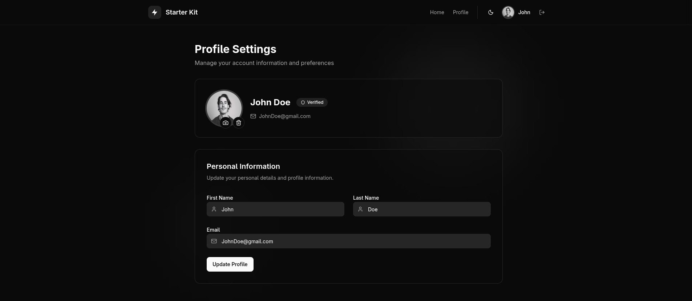

# Spring Boot + React Starter Kit

A modern full-stack web application template with Spring Boot backend and React frontend, featuring authentication, file uploads, and containerized deployment.



## Features

- JWT authentication with OAuth2 (GitHub & Google)
- Email verification on registration
- Forgot password with code-based reset
- User profile management with avatar upload (Google Cloud Storage)
- Dark/light theme support
- Fully containerized with Docker Compose

## Tech Stack

| Layer | Technology |
| ------ | ------------ |
| **Backend** | Spring Boot 4, Java 21, PostgreSQL |
| **Frontend** | React 19, TypeScript, Tailwind CSS, Vite |
| **Infrastructure** | Docker Compose, Google Cloud Storage |

---

## Quick Start

### Prerequisites

- Docker and Docker Compose
- Java 21 (for local development)
- Node.js 22+ (for local development)

### Using Docker (Recommended)

1. Clone and start:

   ```bash
   git clone https://github.com/RianNegreiros/spring-react-starter-kit.git
   cd spring-react-starter-kit
   docker compose -f infra/docker-compose.yml up
   ```

2. Access:
   - Frontend: <http://localhost:5173>
   - Backend API: <http://localhost:8080>
   - Database: localhost:5432
   - MailHog (Email testing): <http://localhost:8025>

### Local Development

**Backend:**

```bash
cd backend && ./mvnw spring-boot:run
```

**Frontend:**

```bash
cd frontend && npm install && npm run dev
```

**Database & Mail service:**

```bash
docker compose -f infra/docker-compose.yml up postgres mailhog
```

---

## Authentication Flows

### Registration & Email Verification

1. User submits registration form (name, email, password)
2. Account is created but marked **unverified**
3. A verification code is sent to the user's email
4. In local dev, view the email at **MailHog → <http://localhost:8025>**
5. User submits the code → account is activated

> Users cannot log in until their email is verified.

**Endpoints:**
```
POST /api/auth/register              – Register a new account
POST /api/email/verify-email         – Submit verification code
POST /api/email/resend-verification-code – Resend the code if it expired
```

---

### Login & Logout

Standard email/password login returns a JWT token used for all subsequent requests.

```
POST /api/auth/login     – Log in, returns JWT
POST /api/auth/logout    – Invalidate session
GET  /api/auth/current   – Get current authenticated user
```

---

### OAuth2 Login (GitHub & Google)

Users can sign in with GitHub or Google — no password required. On first login, an account is automatically created.

- GitHub: redirects to `/login/oauth2/code/github`
- Google: redirects to `/login/oauth2/code/google`

See [OAuth2 Setup](#oauth2-setup) below to configure credentials.

---

### Forgot Password

1. User requests a reset by entering their email
2. A reset code is sent to that email
3. User submits the code to validate it
4. User sets a new password using the validated code

**Endpoints:**
```
POST /api/user/password/forgot         – Send reset code to email
POST /api/user/password/validate-code  – Confirm the code is valid
POST /api/user/password/reset          – Set new password with code
```

> In local dev, find the reset email in MailHog at <http://localhost:8025>

---

### Profile & Avatar

Authenticated users can update their profile and upload a profile picture.

```
PUT    /api/user/profile  – Update name, bio, etc.
POST   /api/avatar        – Upload avatar (multipart/form-data)
DELETE /api/avatar        – Remove avatar
```

Avatars are stored in **Google Cloud Storage** — see [Google Cloud Setup](#google-cloud-for-avatar-upload) below.

---

## Configuration

### Google Cloud (for Avatar Upload)

1. Create a [Google Cloud project](https://console.cloud.google.com/)
2. Enable Cloud Storage API and create a bucket
3. Install [Google Cloud CLI](https://docs.cloud.google.com/sdk/docs/install-sdk)
4. Run: `gcloud auth application-default login`

### OAuth2 Setup

**GitHub:**

- Go to Settings > Developer settings > OAuth Apps > New OAuth App
- Homepage: `http://localhost:5173` | Callback: `http://localhost:8080/login/oauth2/code/github`

**Google:**

- [Google Cloud Console](https://console.cloud.google.com/) > APIs & Services > Credentials > Create OAuth 2.0
- Redirect URI: `http://localhost:8080/login/oauth2/code/google`

### Backend Configuration

Update `backend/src/main/resources/application.properties`:

```properties
app.frontend.url=http://localhost:5173

# OAuth2
spring.security.oauth2.client.registration.github.client-id=YOUR_ID
spring.security.oauth2.client.registration.github.client-secret=YOUR_SECRET
spring.security.oauth2.client.registration.google.client-id=YOUR_ID
spring.security.oauth2.client.registration.google.client-secret=YOUR_SECRET

# GCP
gcp.project-id=your-project-id
gcp.bucket-name=your-bucket-name

# Database (use 'localhost' for local dev)
spring.datasource.url=jdbc:postgresql://postgres:5432/backend_db
```
